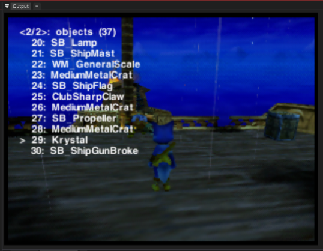

# DinoSDK
Workspace for building custom DLLs for Dinosaur Planet.  
Windows-only for now, sorry nerds ¯\\\_(ツ)\_/¯

Currently this includes a small example menu, that can be easily extended:  

## Instructions
1. Put your cracked ROM (rename it to dino.z64) in build/rom
2. Now run build/extract_fst.bat
3. Now you can run dll_test/make.bat, which will produce a new rom for you in build/rom called out.z64

Tip: you can edit files in build/fst_work

## [DinoFST](https://github.com/HugoPeters/dinofst)
DinoSDK uses [DinoFST](https://github.com/HugoPeters/dinofst) to convert MIPS .ELFs to DP compatible .DLLs and extract/repackage the ROM.  Please see that repository for more info to the inner workings as well as credits:
https://github.com/HugoPeters/dinofst
